# Building an end-to-end training and deployment solution for MLOps 

In this project an end-to-end ML model pipeline has been buil, published and triggered to train a new model which was then deployed in an Azure container instance and made available for inference. The pipeline starts with the default data set for bank marketing and then employs an auto ML step to create a model.

## Architectural Diagram
The project is built to include a simple training pipeline based on a registered dataset in Azure ML. The best model of a successful run is then deployed as a Azure container instance with logging through Application insights. The pipeline can be triggered through an endpoint or Azure ML directly. 

## Key Steps
While all steps have been done programmatically, they are represented here often through the UI.

First we registered the relevant dataset. Please note that the data set was registered twice once through the UI but due to wrong name, it was registered under the correct name throught the script.
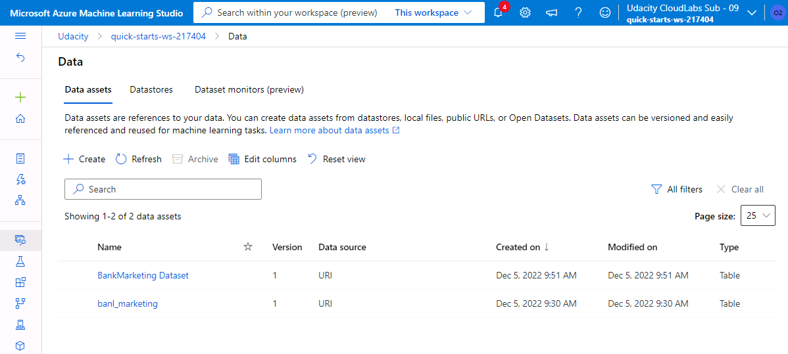

The dataset was then combined with an AutoML step to create a training pipeline creating models based on the dataset.
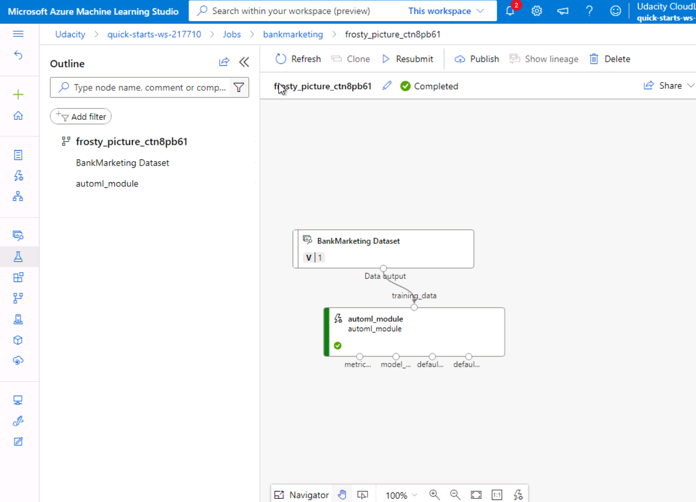

Then a run was triggered of the pipeline that completed successfully
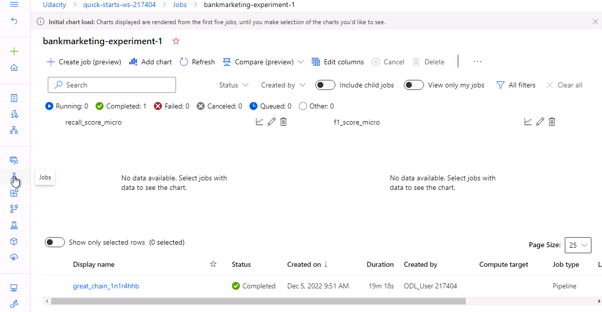

The best model from the automl run was registered ...
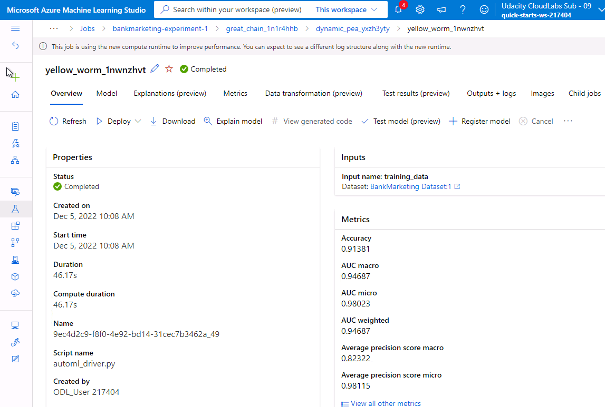

And released as a webservice based endpoint with Application Insights activated for logging purposes (please not that the screenshot was taken during transition phase which is why some values are not available).
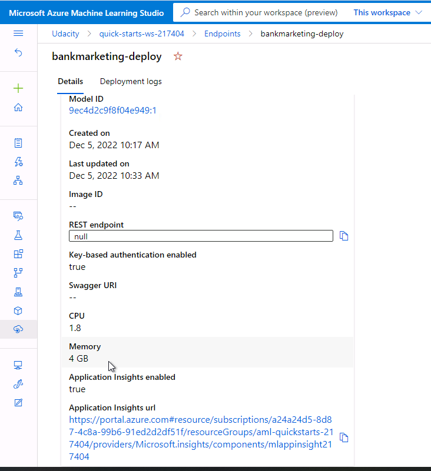

The model endpoint on deployment completion was asked through a python notebook to make test forecast and returned the expected results. 
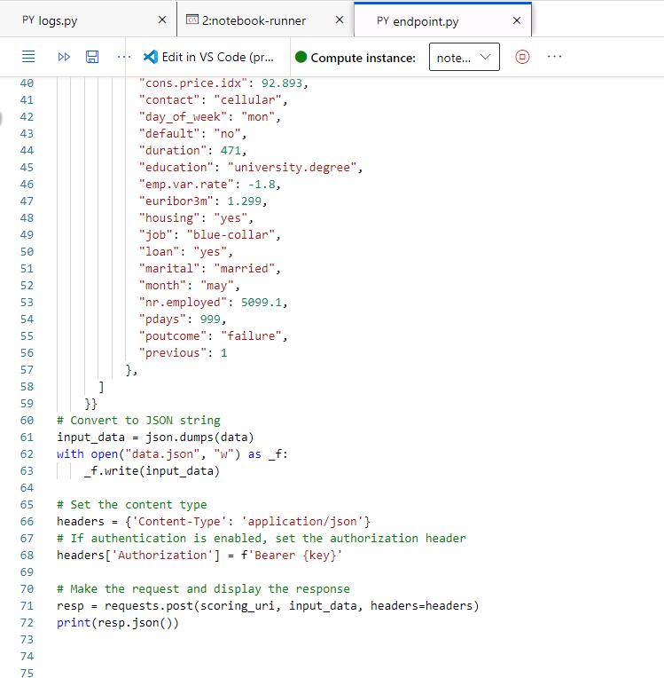
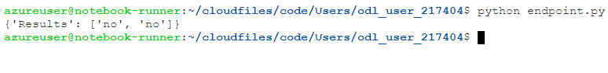

The logs could be easily checked through a separate python script.
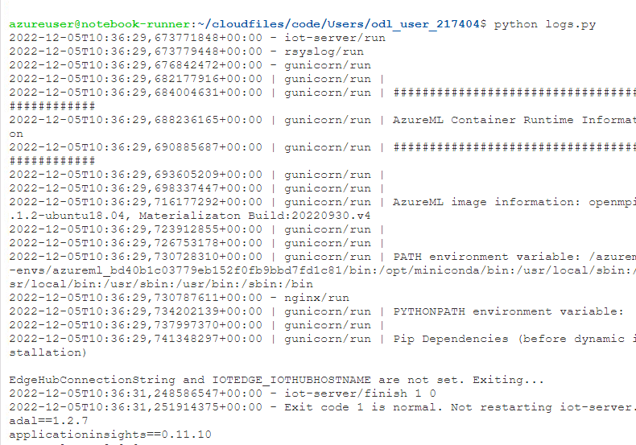

More information for the endpoint was generated using swagger.
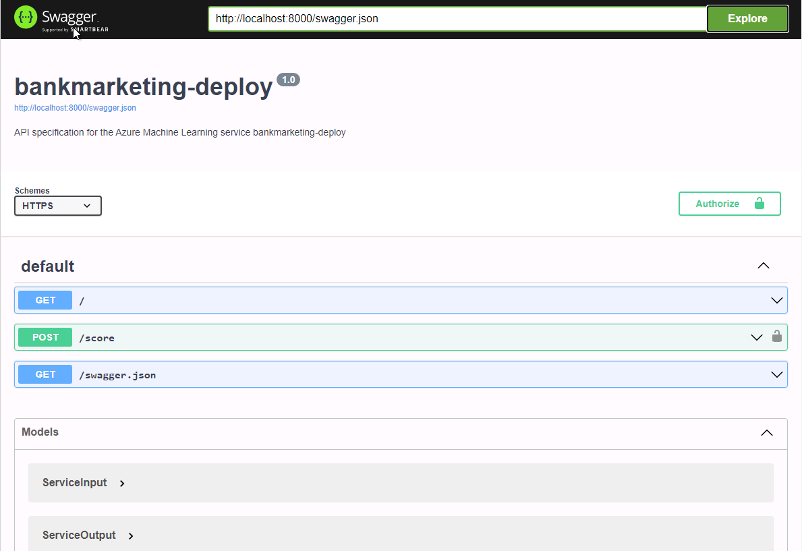

The training pipeline was registered and an endpoint created to allow for remotely or automatically triggering the training pipeline.

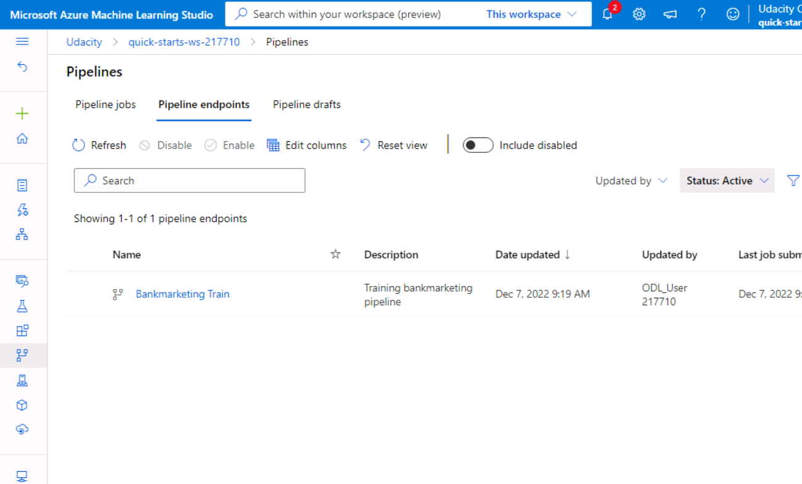

In the python notebook the details of the triggered pipeline runs can be checked and we see, everythign worked.
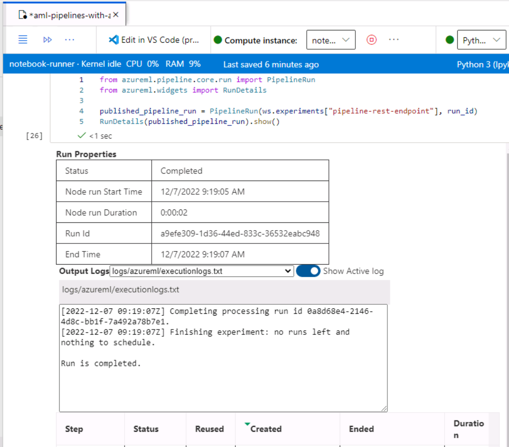

! Please note: Due to the virtual machine crashing, there are screenshots from 2 different implementations and thus names will not always match in the screenshots.

## Screen Recording
https://youtu.be/xawKrqBMtSw

## Standout Suggestions
Unfortunately due to the VM crash there was little time to do standout suggestions but some experiments with coding in different pipeline steps were explored.

## Future development and improvements
- Working with different steps in the ML pipeline such as feature engineering, parallelisation
- Add model registration and release to pipeline